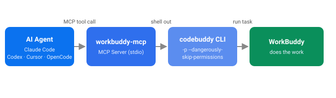

# workbuddy-mcp

> Let any AI coding agent drive WorkBuddy as a sub-agent — install with one command, works with four clients.
>
> 让任意 AI 编程助手（Claude Code / Codex / Cursor / OpenCode）把 WorkBuddy 当「子 Agent」调用——一条命令装好，四大客户端通吃。

[](LICENSE)
[](https://github.com/LinHaiJ/workbuddy-mcp)
[](package.json)
[](https://github.com/LinHaiJ/workbuddy-mcp/actions/workflows/smoke.yml)

**English** · [简体中文](#简体中文)

---

## What it does / 它做什么

`workbuddy-mcp` is a tiny MCP (Model Context Protocol) server that wraps the official **WorkBuddy CLI (`codebuddy`)**. It exposes a single tool — `run_workbuddy_task` — so any MCP-capable agent can delegate real work to WorkBuddy without you copy-pasting between apps.

`workbuddy-mcp` 是一个极小的 MCP（模型上下文协议）服务器，封装了官方的 **WorkBuddy 命令行（`codebuddy`）**。它只暴露一个工具 `run_workbuddy_task`，让任何支持 MCP 的 Agent 都能把真实任务委托给 WorkBuddy，不必在多个应用之间来回复制粘贴。

You do **not** need to understand MCP to use it: `npx -y workbuddy-mcp --install` detects your installed agents and registers the server for you.

你**不需要懂 MCP** 就能用：一条 `npx -y workbuddy-mcp --install` 会自动检测你装了的 Agent 并注册好。

## Table of Contents / 目录

- [Architecture / 架构](#architecture--架构)
- [Features / 特性](#features--特性)
- [Quick Start / 快速开始](#quick-start--快速开始)
- [Installation / 安装](#installation--安装)
- [Usage / 用法](#usage--用法)
- [Configuration / 配置](#configuration--配置)
- [Security note / 安全提示](#security-note--安全提示)
- [Why / 为什么做这个](#why--为什么做这个)
- [FAQ](#faq)
- [Roadmap / 路线图](#roadmap--路线图)
- [Contributing / 贡献](#contributing--贡献)
- [License / 许可证](#license--许可证)

## Architecture / 架构



```
Your agent (Claude Code / Codex / Cursor / OpenCode)
      │  calls MCP tool: run_workbuddy_task(prompt)
      ▼
workbuddy-mcp   (this server, stdio MCP)
      │  shells out:
      ▼
codebuddy -p "<prompt>" --dangerously-skip-permissions
      │
      ▼
WorkBuddy   (does the actual work, returns text)
```

## Features / 特性

| Feature | Why it matters |
|:--------|:---------------|
| One-command install | `npx -y workbuddy-mcp --install` auto-registers to every detected agent — no manual JSON. |
| 4 clients, 1 server | Claude Code, Codex, Cursor, OpenCode share the identical tool. |
| Wraps the official CLI | Uses `codebuddy` — the same engine as the WorkBuddy desktop app. Nothing proprietary. |
| `cwd` control | Each call can target a working directory so WorkBuddy writes files exactly where you want. |
| Configurable | `WB_*` env vars tune timeout, permissions, command path, default cwd. |
| Zero build step | Plain ESM JavaScript, Node 18+. No TypeScript compile. |

| 特性 | 价值 |
|:----|:----|
| 一条命令安装 | `npx -y workbuddy-mcp --install` 自动注册到所有检测到的 Agent，无需手改 JSON。 |
| 一个 Server，四个客户端 | Claude Code、Codex、Cursor、OpenCode 共用同一个工具。 |
| 封装官方 CLI | 用 `codebuddy`——和 WorkBuddy 桌面端同一套引擎，没有私有黑盒。 |
| 可控的工作目录 | 每次调用可指定 `cwd`，让 WorkBuddy 把文件写到你指定的地方。 |
| 可配置 | `WB_*` 环境变量调节超时、权限、命令路径、默认目录。 |
| 零构建 | 纯 ESM JavaScript，Node 18+，无需编译 TypeScript。 |

## Quick Start / 快速开始

> Prerequisite: install and log into the WorkBuddy CLI **once** (interactively).
> 前置：先装好并登录一次 WorkBuddy 命令行（仅需一次，会打开登录流程）。

```bash
# 1. Install & log in the WorkBuddy CLI
npm install -g @tencent-ai/codebuddy-code
codebuddy -p "hello" --dangerously-skip-permissions   # first run opens a login flow

# 2. Install the MCP server into every agent you have
npx -y workbuddy-mcp --install
```

Then in any agent, just say e.g. *"use workbuddy to read data.csv and draft a weekly report"* — the agent calls `run_workbuddy_task` for you.

然后，在任意 Agent 里说「让 workbuddy 读取 data.csv 写一份周报」即可——Agent 会自动调用 `run_workbuddy_task`。

## Installation / 安装

**Option A — one command (recommended)**
```bash
npx -y workbuddy-mcp --install
```
Detects Claude Code / Codex / Cursor / OpenCode on your machine and registers the server. Re-run after installing a new agent.

**Option B — from npm, then install**
```bash
npm install -g workbuddy-mcp
workbuddy-mcp --install
```

**Option C — manual (any MCP client)**
Point your client at `node <path>/server.js`. Examples:

**Claude Code**
```bash
claude mcp add -s user workbuddy -- node /abs/path/to/workbuddy-mcp/server.js
```
**Codex**
```bash
codex mcp add workbuddy -- node /abs/path/to/workbuddy-mcp/server.js
```
**Cursor** — write to `~/.cursor/mcp.json`:
```json
{ "mcpServers": { "workbuddy": { "command": "node", "args": ["/abs/path/to/workbuddy-mcp/server.js"] } } }
```
**OpenCode** — write to `opencode.json` (project root or `~/.config/opencode/opencode.json`):
```json
{ "mcp": { "workbuddy": { "type": "local", "command": ["node", "/abs/path/to/workbuddy-mcp/server.js"], "enabled": true } } }
```
See [`opencode.json.example`](opencode.json.example) for a ready-to-use template with `cwd` / `WB_*` env wired in.

## Usage / 用法

The server exposes **one tool**. Your agent calls it for you; you can also invoke it directly.

```js
// Tool: run_workbuddy_task
{
  prompt: "读取 ./reports 下的 CSV，生成一份中文月度总结",  // required 必填
  cwd:    "/path/to/your/project",   // optional 可选: where WorkBuddy reads/writes files
  model:  "sonnet",                  // optional 可选: model alias
  json:   true                       // optional 可选: request --output-format json
}
```

Things you might hand to your agent:

- *"让 workbuddy 在我仓库根目录跑测试，把失败日志整理成 Markdown"*
- *"use workbuddy to refactor src/utils.ts and explain the changes"*

> **Where do the files go?** Text answers come back into the chat. Files WorkBuddy *writes* land in its `cwd` (the call's `cwd` → else `WB_CWD` → else the agent's working folder). They are not auto-added to your agent's context — read them from disk.

## Configuration / 配置

All tuning is via environment variables — set them in your agent's MCP config `environment` block.

| Variable | Default | Meaning |
|:--------|:-------:|:--------|
| `WB_COMMAND` | `codebuddy` | The CLI to drive. If `command not found`, point to the absolute path (e.g. `C:\...\codebuddy.cmd`). |
| `WB_SKIP_PERMISSIONS` | `true` | `true` adds `--dangerously-skip-permissions` (needed for scripted file/network tools). Set `false` to keep interactive approval. |
| `WB_TIMEOUT` | `600000` | Per-task timeout in ms (10 min). Tasks exceeding it are killed. |
| `WB_CWD` | _(unset)_ | Default working directory used when a call doesn't pass `cwd`. |
| `WB_MODEL` | _(unset)_ | Default model used when a call doesn't pass `model` (e.g. `hy3`, `deepseek-v4-flash`, `glm-5.3`, `kimi-k3-1`, `auto`). |
| `WB_FALLBACK_MODEL` | _(unset)_ | Model to auto-switch to when the primary is overloaded/rate-limited (maps to `--fallback-model`, only works with `--print`). **This is the fix for "free model rate-limited" situations.** |

### Switching models / 切换模型

The `codebuddy` CLI exposes `--model <id>` and `--fallback-model <id>` (the latter only takes effect under `--print`, which this server always uses). This server surfaces both:

- **Per call** — pass `model` and/or `fallbackModel` to `run_workbuddy_task`.
- **Globally** — set `WB_MODEL` and/or `WB_FALLBACK_MODEL` in the agent's MCP `environment` block; they apply when the call doesn't pass them.

Available models (from `codebuddy --help`): `auto`, `hy3`, `hy3-x`, `glm-5.3`, `glm-5.2`, `glm-5.1`, `glm-5v-turbo`, `minimax-m3`, `kimi-k3-1`, `kimi-k2.7`, `kimi-k2.6`, `deepseek-v4-flash`, `deepseek-v4-pro`.

**Rate-limited on the free model?** Don't hard-switch — add a fallback so hy3 stays primary but auto-recovers when overloaded:

```jsonc
// opencode.json / claude mcp config environment
{
  "WB_MODEL": "hy3",
  "WB_FALLBACK_MODEL": "deepseek-v4-flash"
}
```

Or per call: `run_workbuddy_task({ prompt: "...", fallbackModel: "deepseek-v4-flash" })`.

切换模型 / 模型切换

`codebuddy` 自带 `--model <id>` 与 `--fallback-model <id>`（`--fallback-model` 仅在 `--print` 下生效，而本服务始终用 `-p`，所以可用）。本服务把两者都暴露出来：

- **单次调用**：给 `run_workbuddy_task` 传 `model` 和/或 `fallbackModel`。
- **全局默认**：在 Agent 的 MCP `environment` 里设 `WB_MODEL` / `WB_FALLBACK_MODEL`，调用未传时使用。

免费模型被限流时，建议**不要硬性切走**，而是加一个回退：hy3 仍是首选，过载时自动切到 `deepseek-v4-flash` 等，等限流恢复又自动用回 hy3。

## Security note / 安全提示

By default `WB_SKIP_PERMISSIONS=true`, which makes `codebuddy` run **without interactive permission prompts**. That is what lets an agent drive it unattended — but it also means anything the agent requests runs automatically. For personal, trusted automation this is fine; if you prefer to keep a human in the loop, set `WB_SKIP_PERMISSIONS=false` in your MCP config.

默认 `WB_SKIP_PERMISSIONS=true`，即 `codebuddy` 会**跳过交互式授权**自动执行。这正是「让 Agent 无人值守地驱动它」所必需的；但也意味着 Agent 请求的任何操作都会自动执行。个人可信自动化场景下没问题；若你想保留人工确认，把 `WB_SKIP_PERMISSIONS` 设为 `false`。

## Why / 为什么做这个

WorkBuddy is a capable agent, but each product (Claude Code, Codex, Cursor, OpenCode…) lives in its own box. There is no official "reverse MCP" to let those products tap into WorkBuddy as a sub-agent. This project is the thin glue: it packages WorkBuddy's own CLI behind a standard MCP tool, so the four most popular coding agents can share one WorkBuddy.

WorkBuddy 本身能力很强，但 Claude Code、Codex、Cursor、OpenCode 各成孤岛，官方并没有提供「反向 MCP」让这些产品把 WorkBuddy 当子 Agent 调用。本项目就是那层薄胶水：把 WorkBuddy 自己的命令行封装成一个标准 MCP 工具，让最主流的几个编程 Agent 共用同一个 WorkBuddy。

## FAQ

**Does this need the WorkBuddy desktop app running?**
No. It drives the `codebuddy` CLI, which is standalone (same engine, terminal form). One desktop login is enough.

**Does this work offline?**
The MCP server is local; the `codebuddy` calls reach WorkBuddy's service, so an internet connection is required for the actual task.

**Will my WorkBuddy desktop chat show what the agent asked?**
`codebuddy` runs as its own session; conversations may not appear in the desktop app's history. That's expected.

## Roadmap / 路线图

- [x] Auto-install for Claude Code / Codex / Cursor / OpenCode
- [ ] Streaming output (show progress instead of waiting for the full result)
- [ ] Optional structured JSON result parsing
- [ ] `codebuddy` not found → guided install hint

## Contributing / 贡献

PRs and ideas are welcome! Issues labeled `good first issue` are a good place to start. See [CONTRIBUTING.md](CONTRIBUTING.md).

Every push / PR runs a smoke test (`.github/workflows/smoke.yml`) that checks syntax on Node 18/20/22 and verifies the server completes an MCP `initialize` → `tools/list` handshake. To run it locally:

每提交 / 开 PR 都会跑一个冒烟测试（`.github/workflows/smoke.yml`），在 Node 18/20/22 上检查语法并验证 Server 能完成 MCP `initialize` → `tools/list` 握手。本地自测：

```bash
npm install
node test/smoke.mjs
```

欢迎 PR 和想法！可以从 `good first issue` 标签的议题入手。

## License / 许可证

MIT © LinHaiJ. See [LICENSE](LICENSE) for details.
